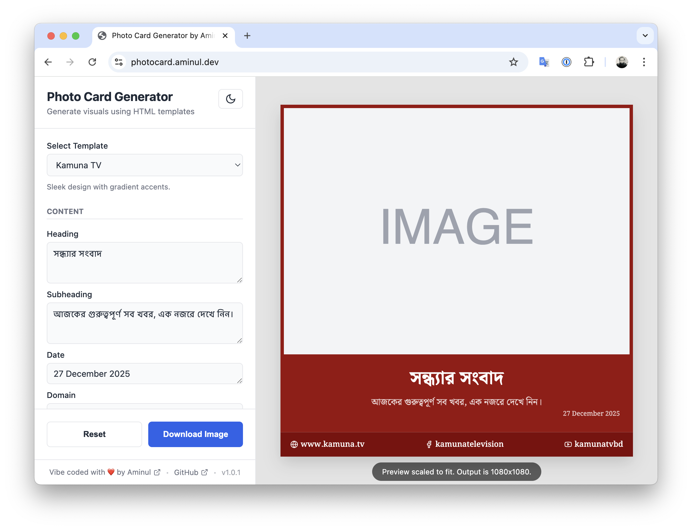

# Photo Card Generator

A web-based tool for creating beautiful, customizable photo cards and social media graphics. Perfect for news websites, bloggers, and content creators who need to generate professional-looking visuals quickly.



## Features

- **Multiple Templates**: Choose from various professionally designed templates including Classic Newspaper, Jamuna, Prothom Alo, and more
- **Bengali Language Support**: Full support for Bengali text with proper fonts and typography
- **Customizable Content**: Edit headings, subheadings, dates, and other text elements
- **Image Integration**: Upload images or use URLs, with scaling, positioning, and object-fit controls
- **Logo and Branding**: Add custom logos and branding elements
- **Color Customization**: Adjust accent colors, background colors, and text colors
- **Font Selection**: Choose from multiple Google Fonts including Bengali-specific fonts
- **Dark/Light Theme**: Built-in theme toggle for the application interface
- **Export to Image**: Generate high-quality PNG images using html2canvas
- **Responsive Design**: Works on desktop and mobile devices
- **Local Storage**: Automatically saves your work and preferences

## Technologies Used

- **HTML5**: Semantic markup and structure
- **CSS3**: Custom properties, flexbox, and responsive design
- **Vanilla JavaScript**: No frameworks, pure JavaScript for optimal performance
- **html2canvas**: Client-side image generation from HTML elements
- **Choices.js**: Enhanced select dropdowns
- **Google Fonts**: Multiple font families including Bengali fonts

## Installation & Setup

### Option 1: Online Version
Visit [photocard.aminul.dev](https://photocard.aminul.dev) to use the tool directly in your browser.

### Option 2: Local Development
1. Clone the repository:
   ```bash
   git clone https://github.com/yourusername/photocard-generator.git
   cd photocard-generator
   ```

2. Open `index.html` in your web browser:
   ```bash
   open index.html
   ```

   Or serve it with a local server for better functionality:
   ```bash
   python -m http.server 8000
   # Then visit http://localhost:8000
   ```

## Usage

1. **Select a Template**: Choose from the available templates in the sidebar
2. **Customize Content**:
   - Edit text fields like heading, subheading, date
   - Add your domain name and social media handles
3. **Add Images**:
   - Upload an image file or enter an image URL
   - Adjust scale, position, and object-fit properties
4. **Customize Appearance**:
   - Choose fonts from the dropdown
   - Pick accent, background, and text colors
5. **Add Branding**:
   - Upload a logo
   - Add advertisement images if supported by the template
6. **Export**: Click the download button to save your creation as a PNG image

## Available Templates

- **Classic Newspaper**: Traditional layout with large image and bottom text
- **Jamuna**: Modern design with overlay text
- **Prothom Alo**: Newspaper-style layout
- **Kaler Kantho**: Clean, professional design
- **Samakal**: Minimalist approach
- **Bangladesh Pratidin**: Structured layout
- **Ittefaq**: Classic newspaper format
- **Manab Zamin**: Traditional styling
- **Amar Desh**: Bold and prominent
- **Naya Diganta**: Elegant design
- **Jugantor**: Dynamic layout
- **Inqilab**: Impactful presentation

## Browser Support

- Chrome 70+
- Firefox 65+
- Safari 12+
- Edge 79+

## Contributing

Contributions are welcome! Please feel free to submit a Pull Request.

1. Fork the repository
2. Create your feature branch (`git checkout -b feature/AmazingFeature`)
3. Commit your changes (`git commit -m 'Add some AmazingFeature'`)
4. Push to the branch (`git push origin feature/AmazingFeature`)
5. Open a Pull Request

### Adding New Templates

To add a new template:

1. Add a new object to the `templates` array in `templates.js`
2. Include `id`, `name`, `description`, `defaults`, `html`, and `css` properties
3. Use template variables in curly braces (e.g., `{heading}`, `{image}`)
4. Test the template thoroughly

## License

This project is licensed under the MIT License - see the [LICENSE](LICENSE) file for details.

## Author

**Aminul Islam**
- Website: [aminul.net](https://aminul.net)
- GitHub: [@AminulBD](https://github.com/AminulBD)

## Acknowledgments

- Icons from [Lucide](https://lucide.dev/) & [Heroicons](https://heroicons.com/)
- Fonts from [Google Fonts](https://fonts.google.com/)
- UI components inspired by modern design principles

---

Made with ❤️ for content creators and news organizations.